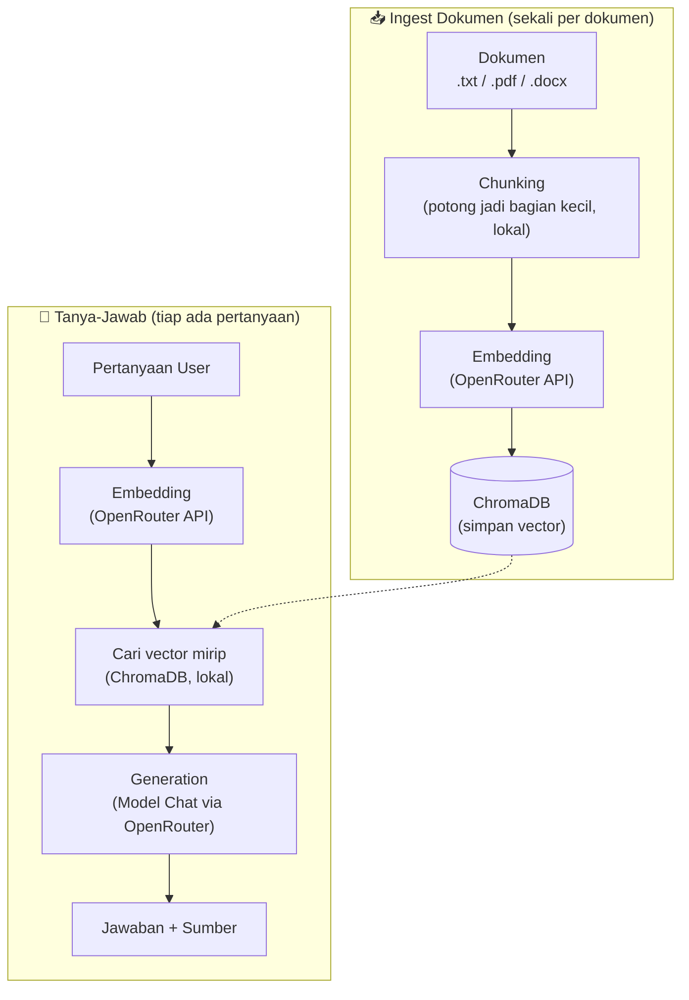

# mini-rag (script version)

RAG (Retrieval-Augmented Generation) sederhana menggunakan [OpenRouter](https://openrouter.ai) sebagai gateway model embedding & chat, dan [ChromaDB](https://www.trychroma.com) sebagai vector database lokal.

Project ini dijalankan langsung sebagai script Python (CLI atau REST API), bukan package yang di-`pip install`. Kalau mencari versi package yang bisa diimport ke project lain, lihat [mini-rag-openrouter](https://pypi.org/project/mini-rag-openrouter/).

## Fitur

- Ingest dokumen `.txt`, `.pdf`, `.docx` dari satu folder sekaligus
- Deteksi dokumen yang sudah pernah di-ingest (skip otomatis, hemat API call)
- Mode CLI (tanya-jawab lewat terminal) dan mode REST API (FastAPI)
- Vector search lokal via ChromaDB, tidak perlu server tambahan

## Alur Kerja



| Tahap | Dikerjakan oleh | Butuh API? |
|---|---|---|
| Chunking | Kode Python lokal | Tidak |
| Embedding | Model embedding via OpenRouter | Ya |
| Simpan & cari vector | ChromaDB (lokal, di disk) | Tidak |
| Generation | Model chat via OpenRouter | Ya |

## Instalasi

```bash
git clone https://github.com/JosinBahaswan/<nama-repo-ini>.git
cd <nama-repo-ini>
pip install -r requirements.txt
```

Buat file `.env` di root project, isi API key OpenRouter:

```
OPENROUTER_API_KEY=sk-or-xxxxxxxx
```

## Pemakaian: Mode CLI

Taruh dokumen (`.txt`/`.pdf`/`.docx`) di folder `./dokumen`, lalu jalankan:

```bash
python main.py
```

Contoh interaksinya:

```
Dokumen siap. Ketik pertanyaan kamu (ketik 'exit' untuk keluar).

Pertanyaan: Apa itu ChromaDB?
[jawaban muncul di sini]

Pertanyaan: exit
Selesai.
```

## Pemakaian: Mode REST API

```bash
uvicorn app:app --reload
```

Buka `http://127.0.0.1:8000/docs` untuk dokumentasi interaktif (otomatis dari FastAPI).

| Method | Path | Fungsi |
|---|---|---|
| `GET` | `/health` | Cek server hidup |
| `POST` | `/ingest` | Upload dokumen |
| `POST` | `/query` | Tanya, dapat jawaban + sumber |

Contoh request ke `/query`:

```json
{"question": "Apa itu ChromaDB?"}
```

Contoh response:

```json
{
  "answer": "ChromaDB adalah vector database...",
  "sources": [
    {"source": "pengantar.txt", "chunk_index": 0}
  ]
}
```

## Struktur Project

```
.
├── .env                  # API key (tidak ikut di-commit)
├── requirements.txt
├── config.py               # konfigurasi & konstanta (base URL, headers, nama model)
├── chunking.py               # potong dokumen jadi chunk kecil
├── embeddings.py                # panggil endpoint /embeddings OpenRouter
├── vector_store.py                 # setup ChromaDB, simpan & cari chunk
├── generation.py                     # panggil endpoint /chat/completions OpenRouter
├── document_loader.py                  # baca .txt / .pdf / .docx dari folder
├── main.py                               # entry point mode CLI
└── app.py                                  # entry point mode REST API (FastAPI)
```

## Catatan

- Semua dokumen di satu `chroma_db/` harus pakai model embedding yang sama sejak awal. Mengganti model embedding di tengah jalan akan membuat vector lama tidak bisa dibandingkan dengan vector baru.
- `chroma_db/` (folder data ChromaDB) tidak ikut di-commit — akan otomatis terbentuk lagi saat `ingest` dijalankan.

## Lisensi

MIT